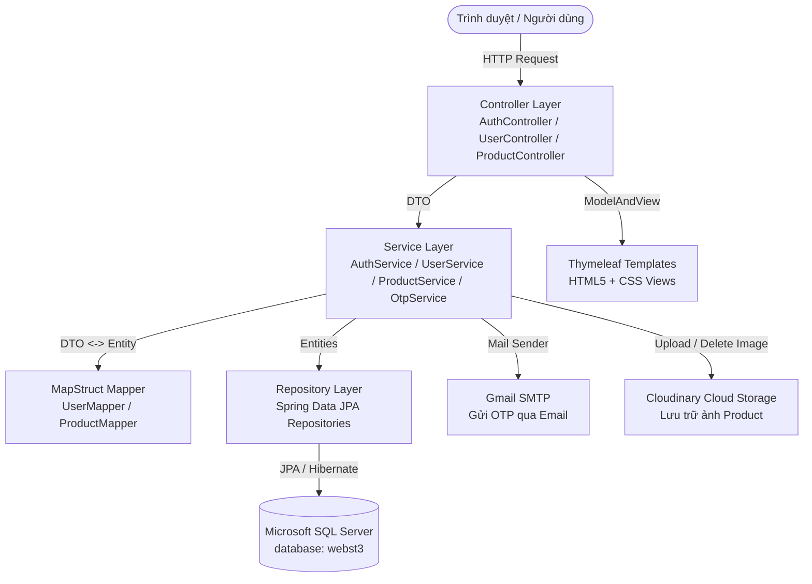

# 🛒 BT09 - VÍ DỤ 3: HỆ THỐNG QUẢN LÝ SHOP VỚI SPRING BOOT 4 + SPRING SECURITY 7 + CLOUDINARY + GMAIL OTP

[](https://spring.io/projects/spring-boot)
[](https://spring.io/projects/spring-security)
[](https://openjdk.org/)
[](https://www.microsoft.com/sql-server)
[](https://www.thymeleaf.org/)
[](https://cloudinary.com/)
[](LICENSE)

Dự án hoàn chỉnh thực hiện **Ví dụ 3** trong chuyên đề **Spring Boot + Spring Security**:
- **Authentication**: Đăng ký xác thực OTP qua Gmail, Đăng nhập lưu Session, Quên mật khẩu & Đổi mật khẩu qua OTP Gmail.
- **User Management**: Phân quyền (`ROLE_ADMIN`, `ROLE_USER`), CRUD tài khoản, tìm kiếm & phân trang, đếm tổng số User và đếm số sản phẩm của từng User.
- **Product Management**: CRUD sản phẩm thuộc quyền sở hữu của User, tìm kiếm & phân trang, upload và xóa ảnh trực tiếp trên Cloudinary.
- **Mapping DTO <-> Entity**: Tự động chuyển đổi dữ liệu bằng MapStruct 1.6.3.
- **Tự động mở trình duyệt**: Khi chạy project, hệ thống tự động bật trình duyệt web trỏ vào trang đăng nhập.

---

## 🏗️ Kiến trúc hệ thống (Architecture)

Dự án áp dụng mô hình chuẩn phân lớp **MVC + Service + Repository + Security**:



---

## 🚀 Danh sách công nghệ sử dụng

| Phân hệ | Công nghệ & Thư viện | Phiên bản |
| :--- | :--- | :--- |
| **Core Framework** | Spring Boot | 4.1.1 |
| **Security** | Spring Security | 7.1.x (Session-based, BCrypt) |
| **Platform** | Java OpenJDK | 21+ |
| **Cơ sở dữ liệu** | Microsoft SQL Server | 2019 / 2022 (Database: `webst3`) |
| **ORM** | Spring Data JPA / Hibernate | 7.4.5 |
| **View Template** | Thymeleaf + Extras Spring Security | 3.1.5 |
| **Object Mapper** | MapStruct | 1.6.3 |
| **Gửi Mail OTP** | Spring Mail (JavaMailSender) | Gmail SMTP TLS |
| **Lưu trữ ảnh** | Cloudinary Java SDK (HTTP5) | 2.0.0 |
| **Validation** | Jakarta Validation (Hibernate Validator) | 3.1.1 |
| **Build Tool** | Apache Maven | 3.9+ |
| **Tiện ích** | Lombok, Spring Boot DevTools | Mới nhất |

---

## 📋 Danh sách chức năng chi tiết

### 1. Xác thực & Bảo mật (Authentication & Authorization)
- **Đăng ký tài khoản (`/register`)**: Nhập username, email, họ tên, mật khẩu. Tài khoản ban đầu có trạng thái `enabled = false`.
- **Gửi OTP qua Gmail**: Hệ thống tự động tạo mã OTP ngẫu nhiên 6 số, băm mã lưu vào bảng `otp_tokens` với thời hạn hiệu lực 5 phút và gửi email đến người dùng.
- **Xác nhận OTP (`/verify-otp`)**: Kiểm tra mã OTP và kích hoạt tài khoản (`enabled = true`).
- **Gửi lại OTP (`/resend-register-otp`)**: Cho phép gửi lại mã OTP mới nếu mã cũ hết hạn.
- **Đăng nhập (`/login`)**: Xác thực qua Spring Security với cơ chế băm mật khẩu `BCrypt`. Quản lý phiên bằng Session.
- **Quên mật khẩu (`/forgot-password`)**: Nhập email đăng ký để nhận mã OTP khôi phục mật khẩu.
- **Đặt lại mật khẩu (`/reset-password`)**: Xác thực mã OTP và cập nhật mật khẩu mới.
- **Đăng xuất (`/logout`)**: Hủy session và xóa cookie `JSESSIONID`.

### 2. Quản lý Người dùng (`/users` - Yêu cầu quyền `ADMIN`)
- Hiển thị danh sách người dùng có **tìm kiếm theo từ khóa** (username, email, họ tên).
- **Phân trang (Pagination)** danh sách người dùng.
- Thêm mới tài khoản với mật khẩu mặc định `123456`.
- Sửa thông tin người dùng, trạng thái kích hoạt, thay đổi quyền hạn (`ROLE_USER` / `ROLE_ADMIN`).
- Xóa tài khoản người dùng kèm xác nhận.
- Đếm tổng số người dùng và đếm số sản phẩm của từng người dùng.

### 3. Quản lý Sản phẩm (`/products` - Yêu cầu Authenticated)
- Danh sách sản phẩm kèm ảnh đại diện, giá, người tạo.
- Tìm kiếm sản phẩm theo tên và mô tả có phân trang.
- Thêm sản phẩm mới kèm **tải ảnh lên Cloudinary** (tự động phân thư mục `shop/products`).
- Chỉnh sửa sản phẩm, xem trước ảnh hiện tại, tự động xóa ảnh cũ trên Cloudinary khi thay ảnh mới.
- Xóa sản phẩm và đồng thời dọn dẹp ảnh trên Cloudinary.
- Mỗi sản phẩm được gắn chặt chẽ với tài khoản User đã tạo ra nó (quan hệ `1 User - N Products`).

### 4. Bảng điều khiển (`/` - Dashboard)
- Thống kê tổng số lượng **Users** trong hệ thống.
- Thống kê tổng số lượng **Products** đã tạo.
- Hiển thị thông tin phiên đăng nhập trên thanh header (Username, Email, Nút Đăng xuất).
- Phím tắt truy cập nhanh vào quản trị Products và Users (tùy theo quyền).

---

## 📂 Cấu trúc thư mục dự án

```
Vi_DU_3/
├── .env                                       # Cấu hình biến môi trường (Database, Port, Mail, Cloudinary)
├── .env.example                               # Mẫu cấu hình môi trường chuẩn
├── .gitignore                                 # Loại trừ target/, .env, cache IDE
├── pom.xml                                    # File khai báo thư viện Maven & Plugins
├── README.md                                  # Tài liệu hướng dẫn sử dụng dự án
└── src/
    └── main/
        ├── java/vn/iotstar/
        │   ├── ShopApplication.java           # Lớp khởi chạy Spring Boot & tự mở trình duyệt
        │   ├── config/
        │   │   ├── CloudinaryConfig.java      # Cấu hình Bean Cloudinary API
        │   │   ├── EncodingConfig.java        # Cấu hình UTF-8 Filter
        │   │   └── SecurityConfig.java        # Cấu hình Spring Security 7 (Filter Chain, Session, Role)
        │   ├── controller/
        │   │   ├── AuthController.java        # Xử lý Login, Register, Verify OTP, Forgot/Reset Password
        │   │   ├── HomeController.java        # Trang chủ Dashboard (Thống kê số lượng)
        │   │   ├── ProductController.java     # Quản lý CRUD, tìm kiếm, phân trang và upload ảnh Product
        │   │   ├── UserController.java        # Quản lý CRUD, tìm kiếm, phân trang User (ADMIN)
        │   │   └── ErrorController.java       # Xử lý hiển thị trang lỗi chung
        │   ├── dto/
        │   │   ├── ForgotPasswordDTO.java     # DTO tiếp nhận email quên mật khẩu
        │   │   ├── LoginDTO.java              # DTO dữ liệu đăng nhập
        │   │   ├── ProductDTO.java            # DTO dữ liệu sản phẩm kèm MultipartFile
        │   │   ├── RegisterDTO.java           # DTO dữ liệu đăng ký
        │   │   ├── ResetPasswordDTO.java      # DTO đặt lại mật khẩu kèm OTP
        │   │   ├── UserDTO.java               # DTO người dùng
        │   │   └── VerifyOtpDTO.java          # DTO xác nhận mã OTP 6 số
        │   ├── entity/
        │   │   ├── OtpToken.java              # Bảng otp_tokens lưu trữ mã OTP băm
        │   │   ├── Product.java               # Bảng products quan hệ ManyToOne với User
        │   │   ├── Role.java                  # Bảng roles (ROLE_ADMIN, ROLE_USER)
        │   │   └── User.java                  # Bảng users quan hệ OneToMany với Product
        │   ├── mapper/
        │   │   ├── ProductMapper.java         # MapStruct ánh xạ Product <-> ProductDTO
        │   │   └── UserMapper.java            # MapStruct ánh xạ User <-> UserDTO
        │   ├── repository/
        │   │   ├── OtpTokenRepository.java    # Truy vấn OTP theo Email và Type
        │   │   ├── ProductRepository.java     # Truy vấn Product, phân trang, đếm theo User
        │   │   ├── RoleRepository.java        # Truy vấn Role
        │   │   └── UserRepository.java        # Truy vấn User, phân trang, đếm số product
        │   ├── security/
        │   │   ├── CustomUserDetails.java     # Implement UserDetails lưu trữ thông tin đăng nhập
        │   │   └── CustomUserDetailsService.java # Nạp thông tin tài khoản từ database
        │   └── service/
        │       ├── AuthService.java           # Interface xác thực tài khoản
        │       ├── CloudinaryService.java     # Interface upload & xóa ảnh đám mây
        │       ├── EmailService.java          # Interface gửi email qua Gmail SMTP
        │       ├── OtpService.java            # Interface sinh và kiểm tra OTP
        │       ├── ProductService.java        # Interface xử lý nghiệp vụ sản phẩm
        │       ├── UserService.java           # Interface xử lý nghiệp vụ người dùng
        │       └── impl/                      # Các lớp triển khai chi tiết (@Service)
        └── resources/
            ├── application.properties         # Cấu hình Spring Boot và nạp biến từ .env
            ├── data.sql                       # Khởi tạo dữ liệu mẫu ban đầu
            ├── static/
            │   ├── css/app.css                # Bộ stylesheet giao diện
            │   └── images/avatar-default.png  # Ảnh avatar mặc định
            └── templates/
                ├── auth/                      # Giao diện xác thực (login, register, otp, reset)
                ├── fragments/                 # Header & Footer dùng chung
                ├── layouts/layout.html        # Layout tổng thể (Head & Page container)
                ├── products/                  # Giao diện danh sách và form sản phẩm
                ├── users/                     # Giao diện danh sách và form người dùng
                ├── home.html                  # Trang Dashboard thống kê
                └── error.html                 # Trang báo lỗi
```

---

## 🛠️ Hướng dẫn cài đặt & Khởi chạy

### 1. Chuẩn bị Cơ sở dữ liệu (SQL Server)
Khởi động dịch vụ SQL Server và đảm bảo đã tạo database `webst3`:
```sql
CREATE DATABASE webst3;
GO
```

### 2. Thiết lập cấu hình biến môi trường (`.env`)
Tạo file `.env` tại thư mục gốc của dự án (ngang hàng với `pom.xml`):
```properties
# ===============================
# DATABASE (SQL Server)
# ===============================
DB_URL=jdbc:sqlserver://localhost:1433;databaseName=webst3;encrypt=false;trustServerCertificate=true;sslProtocol=TLSv1.2;characterEncoding=UTF-8
DB_USERNAME=sa
DB_PASSWORD=13234

# ===============================
# JPA
# ===============================
DDL_AUTO=update
SHOW_SQL=true

# ===============================
# SERVER PORT
# ===============================
SERVER_PORT=8089

# ===============================
# SMTP GMAIL (Gửi mã OTP thực tế)
# ===============================
MAIL_HOST=smtp.gmail.com
MAIL_PORT=587
MAIL_USERNAME=anhkhoi31082006@gmail.com
MAIL_PASSWORD=bgyznyvysgjxgbdl

# ===============================
# CLOUDINARY (Lưu ảnh sản phẩm)
# ===============================
CLOUDINARY_CLOUD_NAME=dfdfdf
CLOUDINARY_API_KEY=576632571682623
CLOUDINARY_API_SECRET=ikPEbngxnKwAw-XkvR1WVEaQZcI
```

> **Lưu ý về Gmail OTP**: Mật khẩu `bgyznyvysgjxgbdl` là App Password (Mật khẩu ứng dụng) 16 ký tự được tạo từ tài khoản Google có bật xác minh 2 bước.

### 3. Khởi chạy ứng dụng

#### Cách 1: Sử dụng IntelliJ IDEA (Khuyên dùng)
1. Mở thư mục dự án bằng **IntelliJ IDEA**.
2. Tìm đến file `vn.iotstar.ShopApplication.java`.
3. Nhấp chuột phải chọn **Run 'ShopApplication'** (hoặc phím tắt `Shift + F10`).
4. **Tự động mở trình duyệt**: Sau khi server khởi động xong, trình duyệt sẽ tự động bật lên và chuyển đến trang đăng nhập: `http://localhost:8089/login`.

#### Cách 2: Sử dụng dòng lệnh (Terminal / Command Prompt)
```bash
mvn clean spring-boot:run
```

---

## 🔑 Tài khoản kiểm thử mặc định (Seed Data)

Khi khởi chạy lần đầu, ứng dụng tự động kiểm tra và khởi tạo tài khoản quản trị:
- **Username:** `admin`
- **Email:** `lehuynhanhkhoi2006@gmail.com`
- **Mật khẩu:** `123456`
- **Vai trò:** `ROLE_ADMIN` (Có toàn quyền quản lý Users, Products và Dashboard).

---

## 🌐 Danh sách URL & Phân quyền truy cập

| URL Path | Phương thức | Mô tả chức năng | Quyền truy cập |
| :--- | :---: | :--- | :--- |
| `/login` | `GET / POST` | Trang đăng nhập và xử lý đăng nhập | `Public` |
| `/register` | `GET / POST` | Đăng ký tài khoản và gửi mã OTP | `Public` |
| `/verify-otp` | `GET / POST` | Xác thực OTP kích hoạt tài khoản | `Public` |
| `/resend-register-otp` | `POST` | Gửi lại mã OTP qua email | `Public` |
| `/forgot-password` | `GET / POST` | Yêu cầu gửi OTP đặt lại mật khẩu | `Public` |
| `/reset-password` | `GET / POST` | Nhập OTP và mật khẩu mới | `Public` |
| `/` | `GET` | Trang Dashboard thống kê hệ thống | `Authenticated` |
| `/products` | `GET` | Danh sách sản phẩm (tìm kiếm, phân trang) | `Authenticated` |
| `/products/create` | `GET / POST` | Thêm sản phẩm mới (upload Cloudinary) | `Authenticated` |
| `/products/edit/{id}` | `GET / POST` | Chỉnh sửa sản phẩm và cập nhật ảnh | `Authenticated` |
| `/products/delete/{id}` | `POST` | Xóa sản phẩm và xóa ảnh trên Cloudinary | `Authenticated` |
| `/users` | `GET` | Danh sách người dùng (tìm kiếm, phân trang) | `ROLE_ADMIN` |
| `/users/create` | `GET / POST` | Thêm người dùng mới | `ROLE_ADMIN` |
| `/users/edit/{id}` | `GET / POST` | Sửa thông tin người dùng, đổi Role | `ROLE_ADMIN` |
| `/users/delete/{id}` | `POST` | Xóa tài khoản người dùng | `ROLE_ADMIN` |
| `/logout` | `POST` | Đăng xuất khỏi hệ thống | `Authenticated` |

---

## 👨‍💻 Tác giả
- **Họ và tên**: Lê Huỳnh Anh Khôi
- **Email**: [lehuynhanhkhoi2006@gmail.com](mailto:lehuynhanhkhoi2006@gmail.com)
- **GitHub**: [@AnthKhoi](https://github.com/AnthKhoi)
